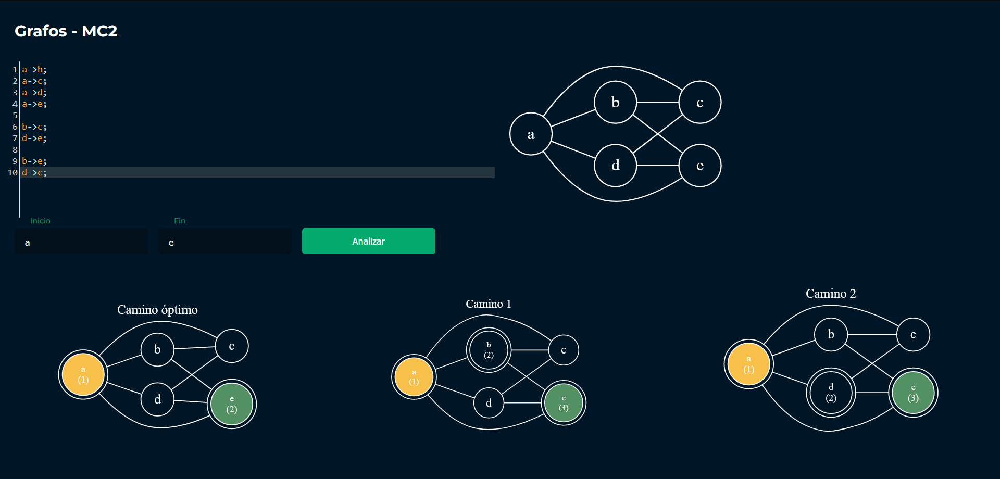

# Proyecto Final - MC2
Brandon Tejaxún 202112030


### :pushpin: Objetivo principal
Buscar caminos simples en grafos no dirigidos conexos <br>
:dart: [Aplicación web](https://brandont2002.github.io/Grafos-MC2/)

### :one: Notación para ingresar el grafo
nodo1 -> nodo2;
```js
a->b;
a->c;
a->d;
a->e;

b->c;
d->e;

b->e;
d->c;
```

### :two: Busqueda y Despliegue de Caminos
En la interfaz se deberá ingresar el vértice inicial y vértice final para ser analizado, finalmente se debe dar clic en la opción de analizar.

<p align="center">	<!-- (optional) center align -->
    
</p>